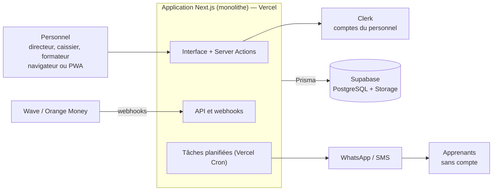

# Kalaas — Cahier des charges MVP (Instituts de formation et enseignement supérieur LMD)

**Version** 1.1 · **Date** 28 septembre 2026 · **Auteur** Mohamed Cheikh Samba · **Éditeur** AFRICATECHNOLOGIE

> **Nouveautés de la version 1.1** : ouverture aux établissements d'enseignement supérieur privés qui suivent le système LMD (Licence, Master, Doctorat) — années académiques, cycles, filières et niveaux, matricule étudiant, réinscriptions annuelles. Nouvelle offre Campus.

## Sommaire

1. [Présentation du projet](#1-présentation-du-projet)
2. [Acteurs et rôles](#2-acteurs-et-rôles)
3. [Périmètre fonctionnel du MVP](#3-périmètre-fonctionnel-du-mvp)
4. [Architecture backend à moindre coût](#4-architecture-backend-à-moindre-coût)
5. [Modèle de données principal](#5-modèle-de-données-principal)
6. [Sécurité, fiabilité et sauvegardes](#6-sécurité-fiabilité-et-sauvegardes)
7. [Estimation des coûts d'infrastructure](#7-estimation-des-coûts-dinfrastructure)
8. [Offres tarifaires (proposition)](#8-offres-tarifaires-proposition)
9. [Planning de réalisation du MVP](#9-planning-de-réalisation-du-mvp)

---

## 1. Présentation du projet

Kalaas est un SaaS multi-tenant qui permet aux instituts de formation et aux établissements d'enseignement supérieur privés au Sénégal de gérer apprenants (ou étudiants), inscriptions et paiements depuis un navigateur ou un téléphone. Le MVP vise un objectif simple : aider l'établissement à mieux encaisser et à ne plus perdre de temps sur Excel et WhatsApp.

**Cible du MVP** :

- **Formation professionnelle** : centres de formation en informatique, langues, couture, esthétique, comptabilité, écoles de formation privées de petite et moyenne taille (20 à 500 apprenants). Formations de quelques mois, sessions qui démarrent toute l'année.
- **Enseignement supérieur LMD** : instituts supérieurs, écoles de commerce et d'ingénieurs, universités privées qui délivrent des Licences, Masters ou Doctorats (100 à plusieurs milliers d'étudiants). Filières organisées en niveaux (L1 → L3, M1 → M2, D1 → D3), année académique d'octobre à juillet, inscription annuelle puis réinscription au niveau suivant.
- **Établissements mixtes**, qui proposent les deux dans le même compte.

Les écoles privées maternelle–lycée viendront en phase 2.

**Objectifs mesurables du MVP**

- Signer 5 établissements payants dans les 3 mois suivant le lancement, dont au moins 1 en LMD
- Réduire le temps de gestion des paiements d'un institut à moins de 15 minutes par jour
- Garder un coût d'infrastructure inférieur à 30 000 FCFA par mois jusqu'à 50 instituts
- Premier client test : E-DEV Academy

## 2. Acteurs et rôles

Le MVP ne crée des comptes que pour le personnel de l'institut : les apprenants reçoivent reçus et relances par WhatsApp/SMS sans avoir à se connecter. Cela garde l'outil simple et évite de payer une authentification par apprenant.

| Rôle | Périmètre | Accès principaux |
| --- | --- | --- |
| Super admin (Kalaas) | Toute la plateforme | Création des instituts, abonnements, support, statistiques globales |
| Directeur / Promoteur | Son institut | Tout l'institut, tableau de bord financier, gestion des utilisateurs |
| Secrétaire / Caissier / Service de la scolarité | Son établissement | Inscriptions et réinscriptions, encaissements, reçus, relances |
| Formateur / Enseignant | Ses sessions ou classes | Liste des apprenants, présences |
| Apprenant / Étudiant (phase 2) | Son dossier | Reçus, solde restant, attestation |

Un même utilisateur peut appartenir à plusieurs établissements (cas fréquent des formateurs et enseignants vacataires).

## 3. Périmètre fonctionnel du MVP

Le MVP tient en 6 modules centrés sur l'argent et les inscriptions ; tout le reste attend la version 2.

### M1 — Paramétrage de l'institut

- Profil (nom, logo, adresse, NINEA, RCCM, téléphones), personnalisation des reçus, préfixe des matricules
- Catalogue des formations : intitulé, durée, frais d'inscription, prix total, nombre de mensualités
- Pour le LMD : cycle (Licence, Master, Doctorat), filière et niveau de chaque formation — une formation correspond à un niveau d'une filière, avec son propre tarif (ex. « Licence Informatique de gestion — L2 »)
- Années académiques (ex. 2026-2027, d'octobre à juillet), dont une marquée « en cours »
- Sessions (cohortes ou classes) : formation, année académique (obligatoire pour le LMD), dates, formateur, capacité, horaires

### M2 — Apprenants et inscriptions

- Fiche apprenant : nom, téléphone WhatsApp, pièce d'identité, tuteur éventuel, photo ; pour le LMD : e-mail, date et lieu de naissance, sexe, diplôme d'accès (série et année du bac)
- Matricule unique par établissement, attribué automatiquement à la première inscription et conservé pendant toute la scolarité (ex. `ITF-2026-0142`)
- Inscription à une session avec génération automatique de l'échéancier (frais + mensualités)
- Réinscription annuelle d'un apprenant existant : passage au niveau supérieur ou redoublement, reliée à l'inscription précédente qui passe au statut « terminée » ; l'historique financier de chaque année reste consultable
- Remises et bourses (montant ou pourcentage), abandon et transfert de session
- Import Excel des apprenants existants (indispensable pour l'adoption)

### M3 — Paiements et caisse

- Encaissement espèces, Wave, Orange Money, virement ; paiements partiels
- Reçu PDF numéroté, envoyé en un clic par WhatsApp
- Paiement en ligne par lien Wave (phase 1.5) avec confirmation automatique
- Clôture de caisse journalière par caissier, annulation tracée (jamais de suppression)

### M4 — Relances

- Liste des impayés et retards par session
- Relance manuelle ou automatique (J-3, J+1, J+7) par WhatsApp ou SMS, modèles de messages modifiables

### M5 — Présences

- Appel par séance sur mobile par le formateur, taux d'assiduité par apprenant

### M6 — Tableau de bord et exports

- Encaissé du jour / du mois, reste à recouvrer, inscriptions par formation (et par niveau et année académique pour le LMD)
- Exports Excel et PDF ; attestation de formation PDF simple ; pour le LMD : attestation d'inscription et certificat de scolarité

> **Hors MVP (version 2 et plus)** : notes et évaluations, semestres, unités d'enseignement (UE) et crédits ECTS, délibérations et procès-verbaux, relevés de notes et diplômes, emplois du temps, portail apprenant / étudiant, écoles maternelle–lycée avec bulletins, comptabilité complète et dépenses, paie des formateurs, application mobile native, mode hors ligne.

## 4. Architecture backend à moindre coût

Kalaas tourne comme une seule application Next.js adossée à une seule base PostgreSQL : pas de microservices ni de serveur séparé, donc peu de choses à payer, à surveiller et à réparer.

Le personnel passe par l'application ; les apprenants ne reçoivent que des messages, ce qui évite tout coût d'authentification par apprenant.

### Stack retenue

| Brique | Choix | Pourquoi |
| --- | --- | --- |
| Application | Next.js (App Router, Server Actions, Route Handlers) | Un seul code pour l'interface et le backend, stack déjà maîtrisée |
| Accès aux données | Prisma + validation Zod | Schéma typé, migrations versionnées |
| Base et fichiers | Supabase (PostgreSQL + Storage) | Base managée, sauvegardes, stockage des reçus au même endroit |
| Authentification | Clerk avec Organizations | Gratuit jusqu'à 50 000 utilisateurs et 100 organisations actives par mois : un institut = une organisation et seul le personnel se connecte |
| Hébergement | Vercel : Hobby pendant le développement, Pro dès le premier client payant | Aucune maintenance serveur ; Hobby est non commercial et se coupe en cas de dépassement. Plan de repli : VPS + Coolify si la facture grimpe |
| Tâches planifiées | Vercel Cron + table de jobs dans PostgreSQL | Pas de service de file d'attente payant |
| Reçus PDF | @react-pdf/renderer côté serveur | Gratuit, rendu fiable |
| WhatsApp | Phase 1 : liens wa.me pré-remplis ; phase 2 : WhatsApp Cloud API | Phase 1 gratuite (un clic du caissier), phase 2 automatique et payée à l'usage |
| SMS | Fournisseur local payé à l'usage | Réservé aux offres supérieures ou refacturé |
| Paiement en ligne | API Wave Business et Orange Money + webhooks | Confirmation automatique des paiements |
| Surveillance | Sentry (offre gratuite) + UptimeRobot | Alertes erreurs et disponibilité sans coût |

### Multi-tenant

- Une base partagée, avec une colonne `institutId` sur chaque table métier
- Isolation en deux couches : une extension Prisma ajoute automatiquement le filtre `institutId` à chaque requête, et le Row Level Security de PostgreSQL sert de filet de sécurité
- Numérotation des reçus propre à chaque institut (séquence par institut et par année)
- Accès par sous-domaine optionnel (`nom-institut.kalaas.app`)

### Règles qui rendent le backend solide

- Montants stockés en entiers (FCFA sans décimales), jamais en nombres flottants
- Paiements immuables : une annulation crée une écriture inverse, jamais une suppression
- Webhooks idempotents : une référence de transaction ne peut être enregistrée qu'une fois
- Journal d'audit sur toutes les opérations d'argent (qui, quoi, quand)
- Toutes les entrées validées côté serveur, même si l'interface les valide déjà

## 5. Modèle de données principal

Le cœur du modèle est la chaîne Inscription → Échéance → Paiement : c'est elle qui calcule qui doit combien. Toutes les tables ci-dessous, sauf Institut et Abonnement, portent `institutId`.

| Entité | Champs clés | Relations |
| --- | --- | --- |
| Institut | nom, logo, NINEA, RCCM, téléphone, sous-domaine, préfixe des matricules, statut | a un Abonnement, des Membres, des Formations |
| Abonnement | offre, date de début, date de fin, statut | appartient à un Institut |
| Membre | utilisateur, rôle (directeur, caissier, formateur) | relie un Utilisateur à un Institut |
| AnneeAcademique | libellé (2026-2027), date de début, date de fin, en cours | regroupe des Sessions |
| Formation | intitulé, cycle (formation courte, Licence, Master, Doctorat), filière, niveau, durée, frais d'inscription, prix total, nombre de mensualités | a des Sessions |
| Session | dates, horaires, capacité, formateur | appartient à une Formation et (en LMD) à une Année académique, a des Inscriptions et des Séances |
| Apprenant | matricule, nom, téléphone WhatsApp, e-mail, naissance, sexe, diplôme d'accès, pièce d'identité, tuteur | a des Inscriptions |
| Inscription | date, type (nouvelle, réinscription, redoublement), remise, statut (active, abandon, terminée) | relie un Apprenant à une Session, pointe vers l'inscription précédente, a des Échéances |
| Échéance | libellé, montant dû, date limite, montant payé, statut | appartient à une Inscription |
| Paiement | montant, mode (espèces, Wave, OM, virement), référence, n° de reçu, caissier | règle une ou plusieurs Échéances |
| Annulation | paiement annulé, motif, auteur | écriture inverse d'un Paiement |
| Séance | date, présences | appartient à une Session |
| Relance | canal, modèle, date d'envoi, statut | vise une Échéance |
| JournalAudit | auteur, action, entité, avant / après, date | trace toutes les opérations sensibles |

Une table de liaison Paiement–Échéance permet de répartir un paiement sur plusieurs mensualités, cas fréquent quand un apprenant rattrape un retard.

## 6. Sécurité, fiabilité et sauvegardes

Un institut doit pouvoir faire confiance à Kalaas pour son argent : aucune donnée ne doit fuiter vers un autre institut ni disparaître.

### Sécurité

- HTTPS partout, sessions sécurisées, mots de passe hachés (géré par Clerk)
- Permissions vérifiées côté serveur à chaque action, selon le rôle du membre
- Isolation par institut en deux couches (extension Prisma + Row Level Security)
- Limitation du nombre de tentatives de connexion et des appels d'API
- Secrets (clés Wave, Orange Money, WhatsApp) uniquement dans les variables d'environnement
- Conformité à la loi sénégalaise sur les données personnelles (déclaration auprès de la CDP)

### Fiabilité

- Paiements immuables et journal d'audit
- Webhooks idempotents, rejouables sans créer de doublon
- Environnement de préproduction séparé pour tester chaque mise à jour
- Alertes d'erreurs (Sentry) et de disponibilité (UptimeRobot)

### Sauvegardes

- Sauvegarde quotidienne automatique de la base
- Copie hebdomadaire supplémentaire hors de Supabase (export vers un autre stockage)
- Test de restauration une fois par mois
- Export Excel complet des données disponible pour chaque directeur

## 7. Estimation des coûts d'infrastructure

L'infrastructure est quasi gratuite pendant le développement, puis coûte environ 27 000 FCFA par mois dès le premier client payant et reste sous 40 000 FCFA jusqu'à 100 instituts. Montants approximatifs, convertis à environ 575 FCFA pour 1 $ ; à revérifier avant engagement.

| Palier | Vercel | Supabase | Clerk | Domaine, e-mails, monitoring | Total mensuel estimé |
| --- | --- | --- | --- | --- | --- |
| Développement (aucun client payant) | Hobby, gratuit | Offre gratuite | Gratuit | ≈ 1 000 FCFA | ≈ 1 000 FCFA |
| Premiers clients (1–50 instituts) | Pro ≈ 11 500 FCFA | Pro ≈ 14 500 FCFA | Gratuit | ≈ 1 000 FCFA | ≈ 27 000 FCFA |
| Croissance (50–100 instituts) | Pro + usage ≈ 11 500 à 17 000 FCFA | Pro + usage ≈ 14 500 à 20 000 FCFA | Gratuit | ≈ 2 000 FCFA | ≈ 28 000 à 39 000 FCFA |
| Au-delà de 100 instituts | Pro + usage | Pro + usage | Pro ≈ 11 500 FCFA et plus | ≈ 3 000 FCFA | À réévaluer, face à plus de 1 000 000 FCFA de revenus mensuels |

Les coûts de WhatsApp Cloud API et de SMS varient avec l'usage : ils sont inclus dans un quota par offre, puis refacturés au-delà. Garder Clerk et Vercel coûte environ 10 000 FCFA de plus par mois qu'un VPS avec une authentification auto-hébergée, soit un client Essentiel, en échange de zéro maintenance serveur.

Sources : [tarifs Clerk](https://clerk.com/pricing), [tarifs Vercel](https://vercel.com/pricing).

## 8. Offres tarifaires (proposition)

Trois offres de 10 000 à 35 000 FCFA par mois, plus une offre Campus sur devis pour les grands établissements LMD : trois clients Essentiel suffisent à couvrir l'infrastructure jusqu'à 50 établissements.

| Offre | Prix mensuel | Apprenants actifs | Utilisateurs | Contenu |
| --- | --- | --- | --- | --- |
| Essentiel | 10 000 FCFA | jusqu'à 100 | 2 | Inscriptions, échéanciers, encaissements, reçus PDF envoyés par lien WhatsApp, exports |
| **Pro** (recommandé) | 20 000 FCFA | jusqu'à 300 | 5 | Essentiel + relances automatiques WhatsApp (quota mensuel), présences, paiement en ligne Wave / Orange Money, gestion LMD (années académiques, réinscriptions) |
| Premium | 35 000 FCFA | jusqu'à 1 000 | illimité | Pro + SMS, plusieurs sites, attestations et certificats personnalisés, support prioritaire |
| Campus | sur devis | plus de 1 000 | illimité | Premium + accompagnement à la reprise des données, formation des équipes de scolarité |

- Paiement annuel : 2 mois offerts
- Frais de mise en place optionnels (import Excel des apprenants + formation du personnel) : 25 000 FCFA
- Essai gratuit de 14 jours sans carte ni paiement
- Messages au-delà du quota : refacturés au coût réel plus une petite marge

## 9. Planning de réalisation du MVP

Le MVP se livre en environ 10 semaines pour un développeur à temps plein, pilote compris ; le lancement commercial n'a lieu qu'une fois trois instituts actifs au quotidien.

| Phase | Semaines | Contenu |
| --- | --- | --- |
| Fondations | 1–2 | Schéma Prisma, auth + instituts, isolation des données, déploiement Vercel |
| Cœur métier | 3–5 | Formations, sessions, apprenants, inscriptions, échéanciers, import Excel ; structure LMD (années académiques, cycles, filières, niveaux, matricule, réinscriptions) |
| Paiements | 6–7 | Encaissements, reçus PDF, clôture de caisse, relances wa.me |
| Pilotage | 8 | Présences, tableau de bord, exports, attestations d'inscription et certificats de scolarité |
| Pilote | 9–10 | E-DEV Academy + 2 établissements (dont au moins un en LMD), corrections |

**Porte de lancement commercial** : 3 instituts utilisent Kalaas chaque jour.

Chaque phase se termine par une démo sur des données réelles d'E-DEV Academy. À ajuster selon la disponibilité en parallèle des autres projets.
